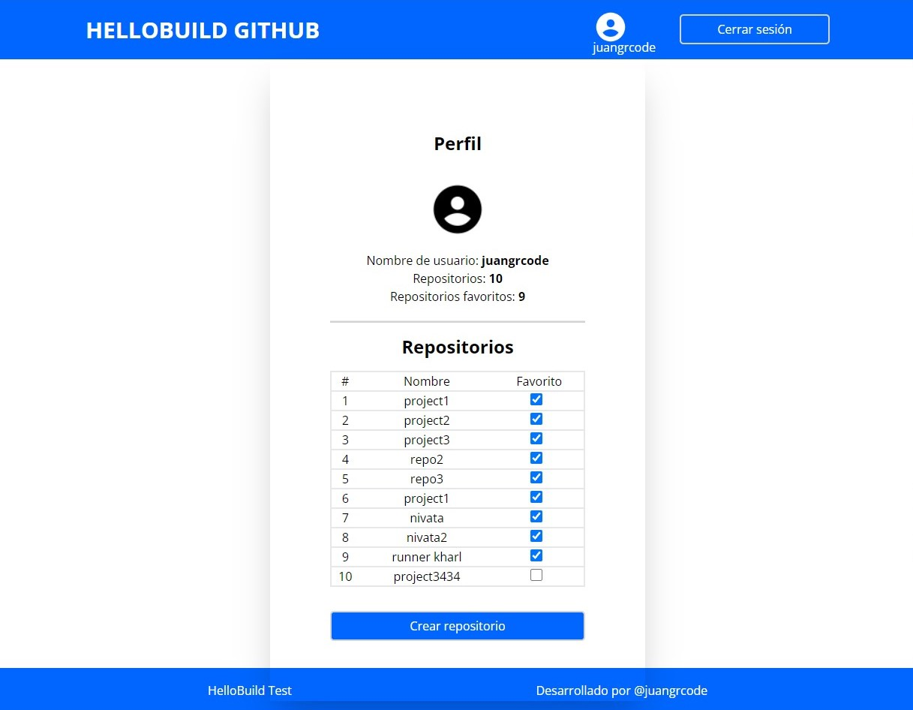

# HELLOWBUILD GITHUB

This project allows users to create a new account on the HELLOBUILD GITHUB page where developers will be allowed to save the code from their repositories, it will allow them to view the profile of each developer and a list of their created repositories.

## Folder organization

- api-auth

  - src
    - config
    - lib
    - models
    - routes
    - services
    - utils
    - index.js
  - package-lock.json
  - package.json
  - .env

- auth-web-app
  - src
    - config
    - context
    - hooks
    - models
    - pages
    - routes
    - services
    - styles
    - index.tsx
  - package-lock.json
  - package.json
  - .env

## Available Scripts

## Frontend => auth-web-app

In the project directory, you can run:

### `npm run start`

Runs the app in the development mode.\
Open [http://localhost:3000](http://localhost:3001) to view it in the browser.

The page will reload if you make edits.\
You will also see any lint errors in the console.

### `npm run build`

Builds the app for production to the `build` folder.\
It correctly bundles React in production mode and optimizes the build for the best performance.

The build is minified and the filenames include the hashes.\
Your app is ready to be deployed!

Application deployment [https://hello-build-test-delta.vercel.app](https://hello-build-test-delta.vercel.app)

## Backend => api-auth

In the project directory, you can run:

### `npm run dev`

Runs the app in the development mode.\
Url backend [http://localhost:3000](http://localhost:3000).

The server will reload if you make edits.\
You will also see any lint errors in the console.

### `npm run build`

Builds the app for production to the `dist` folder.\

Your app is ready to be deployed!

Application deployment [https://hello-build-test-74ky.vercel.app](https://hello-build-test-74ky.vercel.app)

# Images project

## Login

## Register

## Profile

## Create Repository

# Test video

Test of making a record with the different functionalities [Test link](https://share.vidyard.com/watch/GAVJHVgAmNLEGjoiKBJdxS?).
